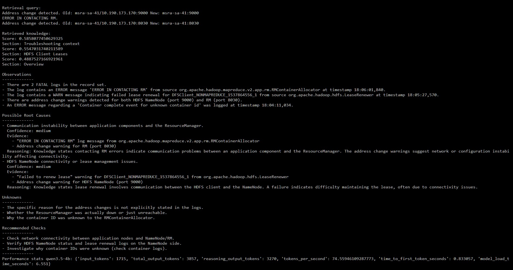

# LLM Support Engineering

A small Python project exploring how local LLMs can assist with software support and incident investigation.

## v0.3 - AI Log Investigator with RAG

The application analyses a public Hadoop log dataset and uses a local LLM to help investigate issues.

v0.3 adds a small RAG knowledge base using Hadoop documentation, allowing the LLM to use relevant background information alongside the log evidence.

### Main features

- Python-based log analysis
- Structured evidence extraction
- Local LLM inference through LM Studio
- Semantic search using embeddings
- Local RAG knowledge base
- Structured JSON LLM output
- Basic validation of LLM responses

## Screenshot



## Model

Development and testing used:

- LM Studio
- Qwen 3.5 4B
- `text-embedding-nomic-embed-text-v1.5`
- 8192-token context
- reasoning enabled

A smaller Qwen 3.5 2B model was also tested.

## Knowledge base

The current knowledge base contains a small amount of Hadoop documentation:

```text
knowledge/
├── yarn.md
├── hdfs.md
└── index.json
```

The knowledge base is intentionally small for the current version and will be expanded in future versions.

## Dataset

The project uses the public **Hadoop 2k** dataset from LogHub.

Place the dataset at:

```text
logs/Hadoop_2k.log
```

The dataset is not included in the repository.

No private or proprietary support logs are included.

## Requirements

- Python 3.11+
- LM Studio
- Compatible local LLM
- Compatible embedding model

Install dependencies:

```bash
python -m pip install -r requirements.txt
```

## Usage

Build the knowledge index:

```bash
python ingest.py
```

Run the investigator:

```bash
python main.py
```

Run tests:

```bash
python -m pytest
```

## Project structure

```text
llm-support-engineering/
├── analyzer.py
├── ingest.py
├── retriever.py
├── llm_client.py
├── main.py
├── knowledge/
├── logs/
├── tests/
├── docs/
├── requirements.txt
└── README.md
```

## Version history

### v0.1

Local LLM CLI.

### v0.2

AI Log Investigator with deterministic log analysis and structured LLM output.

### v0.3

Added semantic retrieval and a local RAG knowledge base using embeddings.

## Future work

- Expand the knowledge base
- Improve hallucination and grounding evaluation
- Add historical incidents and runbooks
- Tool calling for logs, metrics, APIs and Kubernetes
- Streaming LLM output
- AI incident copilot
