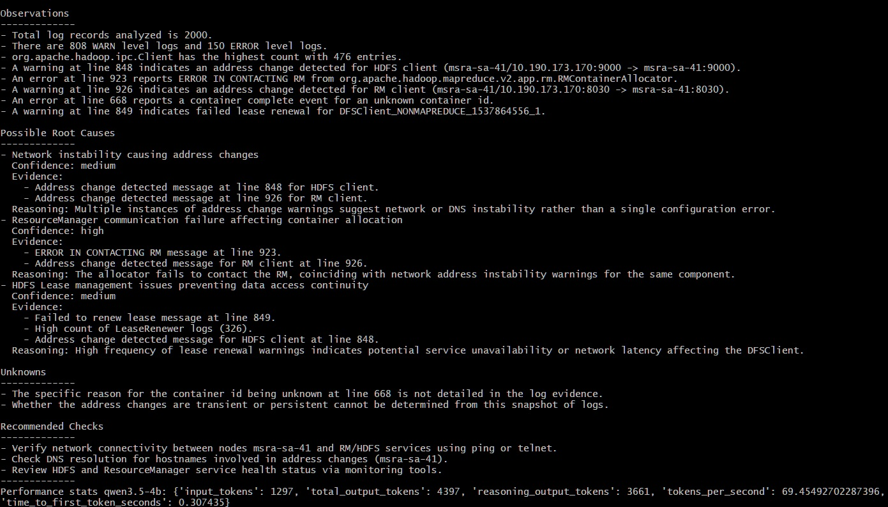

# LLM Support Engineering

A small Python project exploring how local LLMs can assist with software support and incident investigation.

## v0.2 — AI Log Investigator

The application analyses a Hadoop log dataset, extracts a compact evidence package, and sends that evidence to a local LLM running through LM Studio.

The design principle is:

> **Deterministic code extracts evidence; the LLM interprets it.**

The LLM returns a structured investigation containing:

- observations
- possible root causes
- confidence levels
- supporting evidence
- unknowns
- recommended checks

Python then parses and validates the structured response before presenting it as an engineer-facing report.

## Architecture

```text
Log file
   ↓
Deterministic analyzer
   ↓
Compact evidence
   ↓
Local LLM
   ↓
Structured JSON
   ↓
Python validation
   ↓
Engineer-facing investigation
```

## Model

Development and testing were performed with:

- LM Studio
- Qwen 3.5 4B
- 8192-token context
- reasoning enabled

A Qwen 3.5 2B model was also tested. The 4B model produced more useful and better-grounded investigation results, at the cost of lower inference speed.

## Example Output



## Dataset

The example log is the public Hadoop 2k dataset from LogHub.

No private or proprietary support logs are included in this repository.

## Requirements

- Python 3.11+
- LM Studio
- A local compatible LLM

Install dependencies:

```bash
python -m pip install -r requirements.txt
```

## Usage

Place the downloaded dataset at:

```text
logs/hadoop_2k.log
```

Start the model in LM Studio, then run:

```bash
python main.py
```

The application analyses the Hadoop 2k dataset from LogHub and produces an L3-style investigation report.

## Testing

Run:

```bash
python -m pytest
```

The current test suite covers the deterministic log-analysis functions.

## Project structure

```text
llm-support-engineering/
├── analyzer.py
├── llm_client.py
├── main.py
├── logs/
├── tests/
├── .gitignore
├── requirements.txt
└── README.md
```

## What's next

Planned future versions will explore:

- hallucination and grounding evaluation
- retrieval-augmented generation (RAG)
- historical incidents and runbooks
- tool calling
- Kubernetes, metrics, and API investigation
- an AI incident copilot
