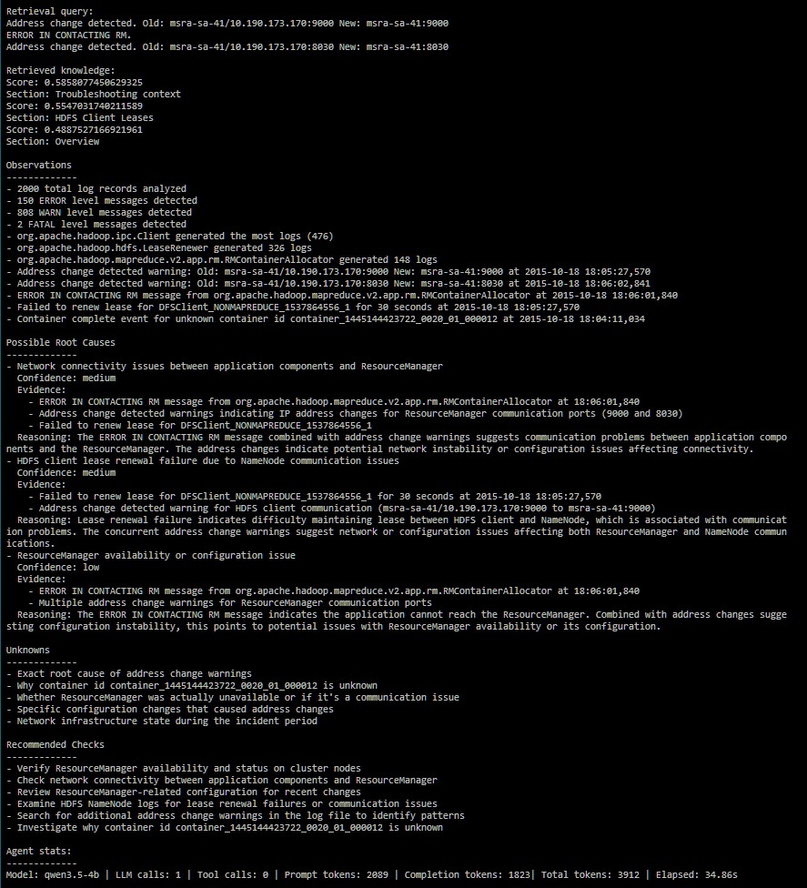

# LLM Support Engineering

A small Python project exploring how local LLMs can assist with software support and incident investigation.

## v0.4 - AI Incident Investigator with RAG and Tool Calling

The application analyses a public Hadoop log dataset and uses a local LLM to investigate incidents.

v0.4 adds LLM tool calling, allowing the model to request additional evidence from the original log through a controlled Python tool.

### Main features

- Python-based deterministic log analysis
- Structured evidence extraction
- Local LLM inference through LM Studio
- Semantic search using embeddings
- Local RAG knowledge base
- LLM tool calling
- Deterministic `search_log()` tool
- Agent loop for tool requests and results
- Structured JSON LLM output
- Basic validation of LLM responses
- Focused pytest coverage

## Tool-calling architecture

```text
main.py
  │
  ├── analyzer.py      log analysis and evidence
  ├── retriever.py     semantic retrieval / RAG
  └── agent.py         LLM <> tool loop
        │
        ├── llm_client.py   LM Studio communication
        └── tools.py         tool definitions / dispatch
                │
                └── analyzer.py
```

The LLM decides when additional log evidence is needed.

Python executes the requested tool deterministically and returns the result to the LLM.

## Tool-calling flow

```text
LLM
 ->
tool request
 ->
Python executes search_log()
 ->
tool result
 ->
LLM interprets the evidence
 ->
structured investigation result
```

## Model

Development and testing used:

- LM Studio
- Qwen 3.5 4B
- `text-embedding-nomic-embed-text-v1.5`
- 8192-token context
- reasoning enabled

A smaller Qwen 3.5 2B model was also tested.

## Knowledge base

```text
knowledge/
├── yarn.md
├── hdfs.md
└── index.json
```

The knowledge base is intentionally small for the current version.

## Dataset

The project uses the public **Hadoop 2k** dataset from LogHub.

Place the dataset at:

```text
logs/Hadoop_2k.log
```

The dataset is not included in the repository.

No private or proprietary support logs are included.

## Requirements

- Python 3.11+
- LM Studio
- Compatible local LLM
- Compatible embedding model

Install dependencies:

```bash
python -m pip install -r requirements.txt
```

## Usage

Build the knowledge index:

```bash
python ingest.py
```

Run the investigator:

```bash
python main.py
```

Run tests:

```bash
python -m pytest
```

## Project structure

```text
llm-support-engineering/
├── analyzer.py
├── agent.py
├── ingest.py
├── llm_client.py
├── main.py
├── retriever.py
├── tools.py
├── knowledge/
├── logs/
├── tests/
├── docs/
├── requirements.txt
└── README.md
```

## Screenshot



## Version history

### v0.1

Local LLM CLI.

### v0.2

AI Log Investigator with deterministic log analysis and structured LLM output.

### v0.3

Added semantic retrieval and a local RAG knowledge base using embeddings.

### v0.4

Added controlled LLM tool calling, a deterministic log search tool, and an agent loop for retrieving additional incident evidence.

## Future work

- Improve hallucination and grounding evaluation
- Add historical incidents and runbooks
- Add additional investigation tools such as contextual log retrieval
- Explore metrics and Kubernetes tools
- Streaming LLM output
- AI incident copilot
